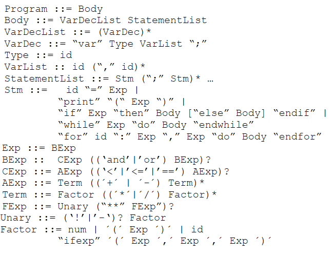

# Proyecto Final - Compiladores CS(30816)
Integrantes:
* Luis David Torres
* Isaac Vera Romero

# Introducción
En el presente proyecto se tuvo como objetivo completar e implementar ciertos requerimientos, que se mencionarán más adelante, de un compilador para un lenguaje imperativo denominado IMP0, el cuál está definido por la siguiente gramática:




En ese sentido, se nos proporción en un folder la implementación del parser, printer, intérprete y typechecker del lenguaje IMP0. Así como también, la implementación del generador de código objeto para las expresiones y sentencias dada por la gramática especificada. El lenguaje objeto para el presente proyecto es el de SVML (Stack Virtual Machine Language) cuya implementación ya fue brindada y en consecuencia se podrá comparar el resultado obtenido por el código objeto generado con el resultado del lenguaje fuente.

A continuación presentamos cada uno de los puntos requeridos para el proyecto y que explicaremos como se logró la implementación de cada uno de ellos.

# 1) Comentarios

Se solicitó que el lenguaje IMP0 tenga la posibilidad de incluir comentarios de una sola línea en cualquier punto del programar. Para ello, los comentarios deben comenzar con // y acabar con fin de línea. Una muestra de caso de uso es el siguiente:

```php
var int x, n; // variables globales
n = 10; // longitud
x = 0;
while x < n
    print(10** x) // imprimir potencia de 10
    x = x+1;
endwhile
```

En ese sentido, para que el lenguaje IMP0 tenga la posibilidad de aceptar comentarios de una sola línea como se mostró en el código anterior se tuvo que modificar el Scanner. En particular, en el método ```nextToken()```, pues como se sabe dicho método es el encargado de identificar los tokens del programa fuente en la etapa de análisis léxico, y por tanto, el encargado de omitir todo aquel no que es parte de la especificación léxica. En ese sentido, se procedió a realizar el cambio siguiendo la manera en como se omiten los carácteres de espacio en blanco. 

Los pasos seguidos fueron:
* Modificar en el método ```nextToken()``` del Scanner la validación del caso que cuando se lea un caracter **'/'** validar si el siguiente carácter es otro caracter **'/'** o no.
* Si se lee un caracter **'/'** luego de haber leído uno ya anteriormente entonces se sigue consumiendo caracteres hasta que se encuentre un salto de linea o fin de programa (**'\0'**), es decir se omite todo lo que hay después de **'//'**.
* En caso contrario, se procede a hacer un rollback y se retorna el token ```Token::DIV```.

```cpp
    case '/':
      c = nextChar();
      if (c == '/') {
        while (c != '\n' && c != '\0') c = nextChar();
        return nextToken();       
      } else {
        rollBack();
        token = new Token(Token::DIV); break;
      }
```
# 2) Generación de Código I

En este punto se solicitó la implementación de código objeto para constantes booleanas, los operadores **and/or** y la versión de for loops considerada por el intérprete. Para el caso del for loop solo se solicitaba de forma incremental, es decir:

```php
for x : 5, 10 do Body endfor
```
El cual ejecuta el **Body** 6 veces con x: 5,6,...,10. Pero también se implementó el loop de forma decremental, es decir:

```php
for x : 10, 5 do Body endfor
```
El cual ejecuta el **Body** 6 veces con x: 10,9,...,5.

En los siguientes items se trabajó con el archivo **imp\_codegen.cpp**, el cual es la implementación del visitor de generación de código. 

**A) Generación de código objeto para constantes booleanas**


* Modificamos el método ```visit(BoolConstExp* e)``` del visitor de generación de código y verificamos si la expresión evaluada es _true_ o _false_ y le asignamos 1 o 0 respectivamente.
* Generamos el código llamando a codegen con los parametros de nolabel, "push" y el valor de la expresión evaluada. 

```cpp
int ImpCodeGen::visit(BoolConstExp* e) { 
  int value = e->b ? 1 : 0;
  codegen(nolabel, "push", value);
  return 0;
}
```

**B) Generación de código objeto para operadores AND/OR**

* Modificamos el método ```visit(BinaryExp* e)``` agregando los casos de los operadores and y or.

```cpp
int ImpCodeGen::visit(BinaryExp* e) {
  e->left->accept(this);
  e->right->accept(this);
  string op = "";
  switch(e->op) {
  case PLUS: op =  "add"; break;
  case MINUS: op = "sub"; break;
  case MULT:  op = "mul"; break;
  case DIV:  op = "div"; break;
  case LT:  op = "lt"; break;
  case LTEQ: op = "le"; break;
  case EQ:  op = "eq"; break;
  case AND: op = "and"; break;// Codigo Objeto para AND
  case OR: op = "or"; break;// Codigo Objeto para OR
  default: cout << "binop " << Exp::binopToString(e->op) << " not implemented" << endl;
  }
  codegen(nolabel, op);
  return 0;
}
```

**C) Generación de código objeto para FOR Loop**

* Agregamos al environment direcciones el id del For, es decir el id del iterator. Esto con el fin de que el bucle For tiene su propia variable local para iterar.
* Generamos código para la expresión 1, es decir para el valor que será el inicio del for. Para ello llamamos al método **accept** de **e1**.
* Almacenamos en memoria el valor generado por **e1**, el cual está en el top de la pila del SVM.
* Creamos el label de la sección del loop.
* Leemos de memoria y se coloca en el top de la pila el valor del iterador.
* Evaluamos el valor de la expresión **e2** invocando al método accept de este.
* Generamos el comparador 'le' que verificará si el valor de e1 es menor o igual que e2.
* Si la comparación resulta falsa, se rompe el bucle yendo al endLabel.
* Si resultada verdadera, generamos código del body.
* Leemos de memoria el valor del iterador y pusheamos 1 para poder incrementar.
* Guardamos en memoria el nuevo valor del iterador y repetirmos el bucle yendo a la etiqueta del bucle.

```cpp
int ImpCodeGen::visit(ForStatement* s) {
  string startLabel = next_label();
  string endLabel = next_label();

  direcciones.add_var(s->id, siguiente_direccion++);

  s->e1->accept(this);
  codegen(nolabel,"store",direcciones.lookup(s->id));
  codegen(startLabel, "skip");
  codegen(nolabel, "load", direcciones.lookup(s->id));
  s->e2->accept(this);
  codegen(nolabel, "le");
  codegen(nolabel, "jmpz", endLabel);
  s->body->accept(this);
  codegen(nolabel, "load", direcciones.lookup(s->id));
  codegen(nolabel, "push", 1);
  codegen(nolabel, "add");
  codegen(nolabel, "store", direcciones.lookup(s->id));
  codegen(nolabel, "goto", startLabel);
  codegen(endLabel, "skip");

  return 0;
}
```

Nota: El compilador es capáz de hacer el bucle for de manera decremental, pero falta implementar la generación de código objeto para ese caso.

# Sentencia do-while

Se implementó la interpretación estándar de la sentencia do-while que tiene la forma:

```php
x= 0; 
do 
    x = x + 1; 
    print(x) 
while x < 5
```
La sentencia anterior imprime 1, 2, 3, 4, 5.

Para ello se siguieron los siguientes pasos:

**A) Modificación a la gramática**

Primero modificamos la gramática en Stm, agregando la sentencia de do-while.

$$
\begin{align*}
\text{Stm} ::= &\ \text{id "=" Exp |} \\
              &\ \text{"print" "(" Exp ")" |} \\
              &\ \text{"if" Exp "then" Body ["else" Body] "endif" |} \\
              &\ \text{"while" Exp "do" Body "endwhile"} \\
              &\ \text{"do" Body "while" Exp |} \\
              &\ \text{"for" id ":" Exp "," Exp "do" Body "endfor"}
\end{align*}
$$


**B) Creación de clase DoWhileStatement**

En el archivo **imp.h** que es el que tiene la definición del AST creamos la clase DoWhileStatement que hereda de la clase abstracta Stm. Asimismo,**imp.cpp** agregamos la implementación de esta nueva clase.

```cpp
class DoWhileStatement : public Stm {
public:
  Exp* cond;
  Body *body;
  DoWhileStatement(Exp* c, Body* b);
  int accept(ImpVisitor* v);
  void accept(TypeVisitor* v);
  ~DoWhileStatement();
};
```

**C) Cambio en el parser**

En el método ```Parser::parseStatement``` que es el encargado de parsear el no terminal Stm, agregamos una nueva condición para que evalue el do-while. 

```cpp
 else if(match(Token::DO)){
    tb = parseBody();
    if(!match(Token::WHILE))
      parserError("Esperaba 'while' en do-while");
    e = parseExp();
    s = new DoWhileStatement(e,tb);
  } 
```

**D) Cambio en los visitors**

En el archivo **imp_visitor.h** que implementa la clase abstracta para los visitors del interprete y printer agregamos un nuevo método para que estos puedan visitar el do-while.

```cpp
virtual int visit(DoWhileStatement* e) = 0;
```
Para el visitor del typechecker, en **type_visitor.h**
```cpp  
virtual void visit(DoWhileStatement* e) = 0;
```


Posteriormente, en los visitor printer, intérprete y typechecker agregamos lo siguiente:

**Printer**
```cpp
int ImpPrinter::visit(DoWhileStatement* s) {
  cout << "do" << endl;
  s->body->accept(this);
  cout << "while ";
  s->cond->accept(this);
  return 0;
}
```

**Intérprete**

Para el intérprete se usó el do-while de C++, ejecutando dentro del do el Body y dentro de la condicional del bucle llamamos al condicional de la clase de DoWhileStament.
```cpp
int ImpInterpreter::visit(DoWhileStatement* s) {
  do {
      s->body->accept(this);
  } while (s->cond->accept(this));
 return 0;
}

```

**Typechecker**

Primero verificamos si es que el Body tiene sus tipos correctos y luego  verificamos si es que la condicional es del tipo booleano.
```cpp
void ImpTypeChecker::visit(DoWhileStatement* s) {
  s->body->accept(this);
  if (!s->cond->accept(this).match(booltype)) {
    cout << "Condicional en DoWhileStm debe de ser: " << booltype << endl;
    exit(0);
  }  
 return;
}
```

**Codegen**

Para el codegen, se hizo similar a como estuvo implementado el WhileStatement, pero se cambió el orden ya que DoWhile ejecuta al menos una vez el Body.

```cpp
int ImpCodeGen::visit(DoWhileStatement* s) {
  string l1 = next_label();
  string l2 = next_label();
  
  codegen(l1,"skip");
  s->body->accept(this);
  s->cond->accept(this);
  codegen(nolabel,"jmpz",l2);
  codegen(nolabel,"goto",l1);

  codegen(l2,"skip");

  return 0;
}
```

# 4) Sentencias break y continue

Se implementó las interpretaciones estándar de **break** y **continue**, las sentencias que permiten salir y terminar un loop o saltar la condición de control del loop. 

Para ello, se realizaron los siguientes pasos.

**A) Cambios en la gramática**

Modificamos la gramática agregando en Stm  los terminales **"break"** y **"continue"**.

$$
\begin{align*}
\text{Stm} ::= &\ \text{...| "break" | "continue"}
\end{align*}
$$

**B) Cambios en la clase Token y el Scanner**

En la clase ```Token``` se agregaron dos nuevos tipos, **BREAK** y **CONTINUE**. También se incrementó de 35 a 37 los ```token_names```.

**Token**
```cpp
// En imp_parser.h
enum Type { ..., BREAK, CONTINUE};
const char* token_names[37]
// En imp_parser.cpp
const char* Token::token_names[37] = {... , "BREAK", "CONTINUE"};
```

**Scanner**

Se agregarón en las palabras reservados "break" y "continue".
```cpp
Scanner::Scanner(string s):input(s),first(0),current(0) {
    ...
    reserved["break"] = Token::BREAK;
    reserved["continue"] = Token::CONTINUE;
}
```

**C) Cambios en el AST**

Se agregaron dos nuevas clases BreakStatement y ContinueStatement, que heredaran de la clase Stm.

```cpp
class BreakStatement : public Stm {
public:
  BreakStatement();
  int accept(ImpVisitor* v);
  void accept(TypeVisitor* v);
  ~BreakStatement();
};

class ContinueStatement : public Stm {
public:
  ContinueStatement();
  int accept(ImpVisitor* v);
  void accept(TypeVisitor* v);
  ~ContinueStatement();
};
```

**D) Cambios en el parser**

Se agregaron dos validaciones para **break** y **continue** en el método ```parseStatement``` del parser.

```cpp

Stm* Parser::parseStatement() {
    ... 
    else if (match(Token::BREAK)) {
        return new BreakStatement();
    } 
    else if (match(Token::CONTINUE)) {
        return new ContinueStatement();
    }
    ...
}
```

**E) Cambio en los Visitors**

Para las clases abstractas de los visitors se agregó lo siguiente:

**En la clase ImpVisitor**
```cpp
virtual int visit(BreakStatement* e) = 0;
virtual int visit(ContinueStatement* e) = 0; 
```

**En la clase TypeVisitor**
```cpp
virtual void visit(BreakStatement* e) = 0;
virtual void visit(ContinueStatement* e) = 0;
```

Ello permitirá que todas las clases que hereden de estas dos clases abstractas tengan que implementar la visita tanto a BreakStatement como a ContinueStatement.

Posteriormente, se modificaron las clases que heredan de cada una de las clases abstractas.

**Printer**

Se agregó la implementación del visitor printer para Break y Continue Stament:

```cpp
int ImpPrinter::visit(BreakStatement* s) {
    cout << "break";
    return 0;
}

int ImpPrinter::visit(ContinueStatement* s) {
    cout << "continue";
    return 0;
}
```
**Codegen**


Se agregó la implementación de los métodos visit a codegen, para ello se usa dos stack denominados loopEndLabels y loopStartLabels, que verifican que si no está vacío el stack de etiquetas de etiquetas se puede realizar el break y continue.

```cpp
int ImpCodeGen::visit(BreakStatement* s) {
    if (!loopEndLabels.empty()) {
        codegen(nolabel, "goto", loopEndLabels.top());
    }
    return 0;
}

int ImpCodeGen::visit(ContinueStatement* s) {
    if (!loopStartLabels.empty()) {
        codegen(nolabel, "goto", loopStartLabels.top());
    }
    return 0;
}
```

Los puntos donde se agregan las etiquetas de End y Start se hace en los bucles. 

**Typechecker**

Para el type checker se agregó una variable auxiliar denomidada loopNestingLevel, ello nos permitirá saber si es que tanto el break como el continue están siendo llamadas dentro bucles. Asu vez, ello nos permite tener bucles anidados y si un break termina un bucle dentro de otro, deberá terminar el interno y no el externo.

En ese sentido, se agrega lo siguiente a la clase ```ÌmpTypeChecker```.


```cpp

class ImpTypeChecker : public TypeVisitor {
public:
  ImpTypeChecker();
private:
  Environment<ImpType> env;
  ImpType booltype;
  ImpType inttype;
  int loopNestingLevel = 0; // Agregado para controlar que se llame dentro de un bucle
  ...
```

En consecuencia, la implementación del visit a BreakStatement y ContinueStatement queda de la siguiente manera:
```cpp
void ImpTypeChecker::visit(BreakStatement* s) {
    if (loopNestingLevel <= 0) {
        cout << "Error: 'break' fuera de un bucle" << endl;
        exit(0);
    }
}

void ImpTypeChecker::visit(ContinueStatement* s) {
    if (loopNestingLevel <= 0) {
        cout << "Error: 'continue' fuera de un bucle" << endl;
        exit(0);
    }
}

```

Las modificaciones a los bucles quedan de la siguiente forma:

```cpp
void ImpTypeChecker::visit(WhileStatement* s) {
  loopNestingLevel++;
  ...
  loopNestingLevel--;
 return;
}

void ImpTypeChecker::visit(DoWhileStatement* s) {
  loopNestingLevel++;
  ...
  loopNestingLevel--;
 return;
}

void ImpTypeChecker::visit(ForStatement* s) {
  loopNestingLevel++;
  ...
  loopNestingLevel--;
 return;
}

```